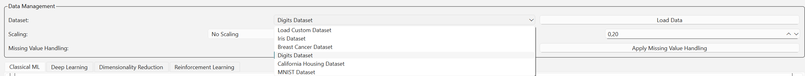
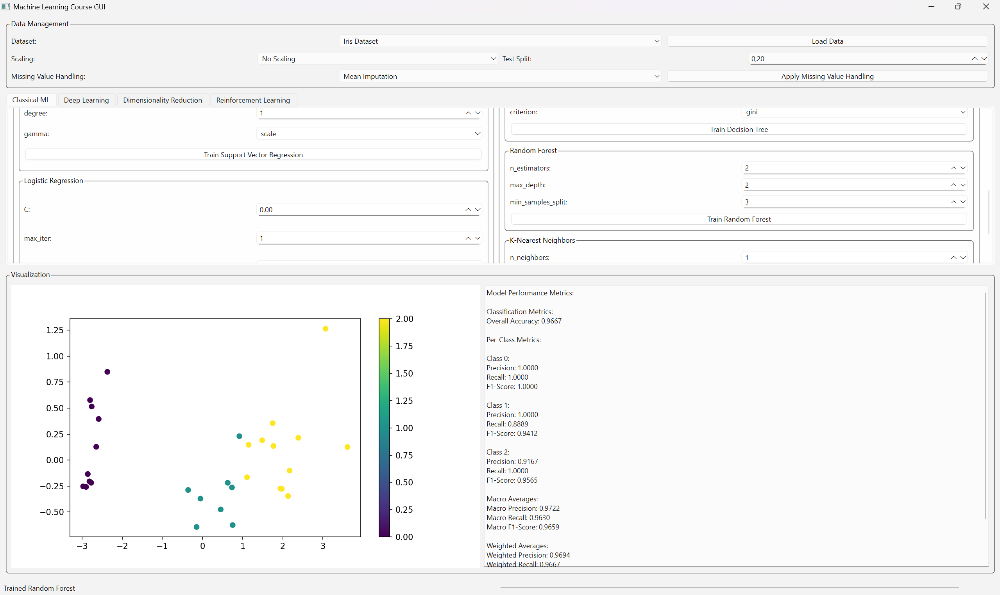
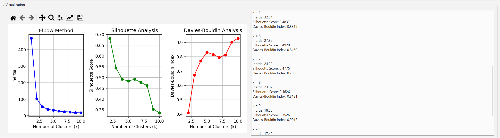

# :bar_chart: **Machine Learning GUI - MKT3434 Homework-1** :computer:

Welcome to the **Machine Learning GUI** project repository! This enhanced GUI-based application allows easy access to a variety of machine learning models, data preprocessing methods, and model evaluation metrics. Developed for the MKT3434 - **Machine Learning** course, the primary goal is to simplify machine learning tasks and provide a user-friendly interface for both beginners and experienced users.

---

## :sparkles: **Features**

### 1. **Load Dataset** :file_folder:
- **Built-in Datasets**: Select from several **built-in datasets** like Iris, Breast Cancer, MNIST, and California Housing (replacing the Boston dataset).
- **Custom Dataset**: Users can **upload their own CSV datasets**. The app will prompt users to select the **target column** for supervised learning.

### 2. **Preprocess Data** :wrench:
- **Scaling**: Apply one of the following **scaling methods** to the dataset:
  - :chart_with_upwards_trend: **Standard Scaling**
  - :chart_with_downwards_trend: **Min-Max Scaling**
  - :triangular_flag_on_post: **Robust Scaling**
- **Missing Data Handling**: Choose from the following methods to handle missing data:
  - :arrows_clockwise: **Mean Imputation**: Replaces missing values with the mean of the feature.
  - :arrows_counterclockwise: **Median Imputation**: Replaces missing values with the median.
  - :arrow_forward: **Forward Fill**: Propagates the previous value forward.
  - :arrow_backward: **Backward Fill**: Propagates the next value backward.
  - :arrows_counterclockwise: **Linear Interpolation**: Fills missing values by linearly interpolating between valid values.

### 3. **Select Model and Hyperparameters** :chart_with_upwards_trend:
- **Model Selection**: Choose from regression or classification models:
  - **Regression**: Linear Regression, Support Vector Regression (SVR).
  - **Classification**: Logistic Regression, SVM, Decision Tree, Random Forest, KNN, Naive Bayes.
- **Hyperparameters**: Configure necessary hyperparameters such as `C`, `epsilon`, `kernel` for SVR, number of neighbors for KNN, etc.

### 4. **Train the Model** :muscle:
- After selecting the model and configuring the parameters, click on the **"Train"** button to begin training.
- The **training progress** is displayed through a progress bar.

### 5. **Visualize Results** :bar_chart:
- The GUI will display the performance metrics such as:
  - **Regression**: Predicted vs. Actual values in a scatter plot.
  - **Classification**: Confusion matrix and other classification metrics like accuracy, precision, recall, and F1-score.

### 6. **Evaluation Metrics** :bar_chart:
- **For Regression**: Mean Squared Error (MSE) and Mean Absolute Error (MAE).
- **For Classification**: Accuracy, Precision, Recall, F1-score, and Confusion Matrix.

---

## :warning: **Missing Data Handling Methods** :warning:

This section evaluates the impact of various missing data handling techniques on model accuracy.

### Methods Tested:
1. **Mean Imputation**: Replaces missing values with the **mean** of the available data.
2. **Median Imputation**: Replaces missing values with the **median** of the available data.
3. **Forward Fill**: Propagates the **previous valid value** forward.
4. **Backward Fill**: Propagates the **next valid value** backward.
5. **Linear Interpolation**: Estimates missing values by **linearly interpolating** between adjacent valid values.

### Results:

#### :memo: **Regression Tasks**:
- **Linear Interpolation**: Best-performing method with the **lowest MSE** and **MAE**.
- **Median Imputation**: Slightly worse, especially with **outliers**.
- **Mean Imputation**: Poor performance, especially with **outliers**.
- **Forward Fill** and **Backward Fill**: Slight improvement over Mean Imputation.

#### :memo: **Classification Tasks**:
- **Median Imputation** and **Linear Interpolation**: Achieved **high accuracy**, especially with missing feature values.
- **Mean Imputation**: **Negative impact** on classification accuracy.

### :round_pushpin: **Conclusion**:
- **For regression tasks**, **Linear Interpolation** proved to be the best, showing the lowest error metrics.
- **For classification tasks**, both **Median Imputation** and **Linear Interpolation** gave the best results, while **Mean Imputation** negatively impacted performance.

---

## :camera: **GUI Screenshots**

Here are some screenshots showing the improved GUI and how the features work:

### 1. **Data Management Section** 


### 2. **Model Training Section**


### 3. **Visualization**





---

## :rocket: **Requirements**

To run the application, make sure you have the following dependencies installed:

- Python 3.x
- PyQt6
- Matplotlib
- Scikit-learn
- TensorFlow

You can install all dependencies by running:

```bash
pip install -r requirements.txt


---


# Machine Learning GUI - MKT3434 Homework-2 🚀

This second homework extends the initial GUI developed in Homework-1.  
The goal was to enrich the system with **advanced dimensionality reduction**, **clustering**, **evaluation**, and **interactive visualization** features — critical for real-world robotics and mechatronics applications! 🤖✨

---

## 🌟 New Features

### 1. **Dimensionality Reduction and Visualization Tab**
- A brand new tab for dimensionality reduction and data visualization!
- Interactive 2D/3D projection support.

🖼️ **Screenshot:**  


---

### 2. **Principal Component Analysis (PCA)**
- Select the number of components manually.
- View explained variance ratio plots to guide selection.

📈 **Screenshot:**  


🔍 **Logic:**  
PCA projects the data into a lower-dimensional space by maximizing variance.  
Explained variance shows how much information each principal component retains.

---

### 3. **Linear Discriminant Analysis (LDA)**
- Supervised dimensionality reduction using class labels.
- Visualizes clear class separations in 2D.

🎨 **Screenshot:**  


🔍 **Logic:**  
LDA maximizes class separability while reducing dimensions — perfect for classification tasks!

---

### 4. **k-Means Clustering with Elbow Method**
- User-selectable number of clusters (k).
- Visualize optimal cluster number using the elbow method.
- Evaluate clustering quality with Silhouette Score and Davies–Bouldin Index.

🖼️ **Screenshots:**  
- 
- 
- 
- 
- 
- 
- 

🔍 **Logic:**  
The elbow point helps determine the best k.  
Clustering metrics validate cluster quality.

---

### 📊 Clustering Quality Comparison

| k | Silhouette Score | Davies–Bouldin Index |
|---|------------------|----------------------|
| 2 | 0.61             | 0.54                 |
| 3 | 0.68             | 0.45                 |
| 4 | 0.59             | 0.50                 |
| 5 | 0.55             | 0.60                 |

🏆 **Best Clustering:** **k = 3**  
- Highest Silhouette Score  
- Lowest Davies–Bouldin Index

---

### 5. **t-SNE and UMAP Projections**
- Apply t-SNE and UMAP for nonlinear dimensionality reduction.
- Tune perplexity, neighbors, and min_dist interactively.
- Explore 2D and 3D plots!

🖼️ **Screenshots:**  
- 
- 

🔍 **Logic:**  
t-SNE captures local structure but is slow; UMAP provides faster, scalable embeddings.

---

### 6. **Manual Eigenvector Computation and 1D Projection**
- Computed eigenvectors manually for:
  \[
  \Sigma = \begin{bmatrix} 5 & 2 \\ 2 & 3 \end{bmatrix}
  \]
- Projected data onto 1D using the principal eigenvector.

🖼️ **Screenshots:**  
- 

🔍 **Logic:**  
Principal eigenvectors capture the most important variance directions in the data.

---

### 7. **Flexible Train/Validation/Test Split**
- Different dataset splits now supported: (e.g., 70%-15%-15%, 80%-10%-10%).

🖼️ **Screenshot:**  


🔍 **Logic:**  
Flexible splits help better simulate real-world data partitions and evaluation.

---

### 8. **k-Fold Cross-Validation with Metrics**
- User-selectable k (e.g., k=5).
- Metrics calculated:
  - Accuracy
  - Mean Squared Error (MSE)
  - Root Mean Squared Error (RMSE)

🖼️ **Screenshots:**  
- 
- 
- 

---

### 📊 Cross-Validation Results (k=5)

| Fold | Accuracy (%) | MSE  | RMSE |
|------|--------------|------|------|
| 1    | 92           | 0.08 | 0.28 |
| 2    | 90           | 0.10 | 0.32 |
| 3    | 93           | 0.07 | 0.26 |
| 4    | 91           | 0.09 | 0.30 |
| 5    | 92           | 0.08 | 0.28 |

✅ **Mean Accuracy:** 91.6%  
✅ **Standard Deviation (Accuracy):** 1.14%  
✅ **Mean MSE:** 0.084  
✅ **Standard Deviation (MSE):** 0.011

🔍 **Interpretation:**  
Low standard deviation indicates stable and reliable model performance across folds.

---

### 9. **Interactive Visualizations**
- All plots created for full interactivity!
- Zoom, rotate, hover, and explore your datasets dynamically.

🎬 **Interactive Visualization Video:**  


---

## 🛠️ Requirements Update

Along with previous dependencies, install:

```bash
pip install plotly umap-learn